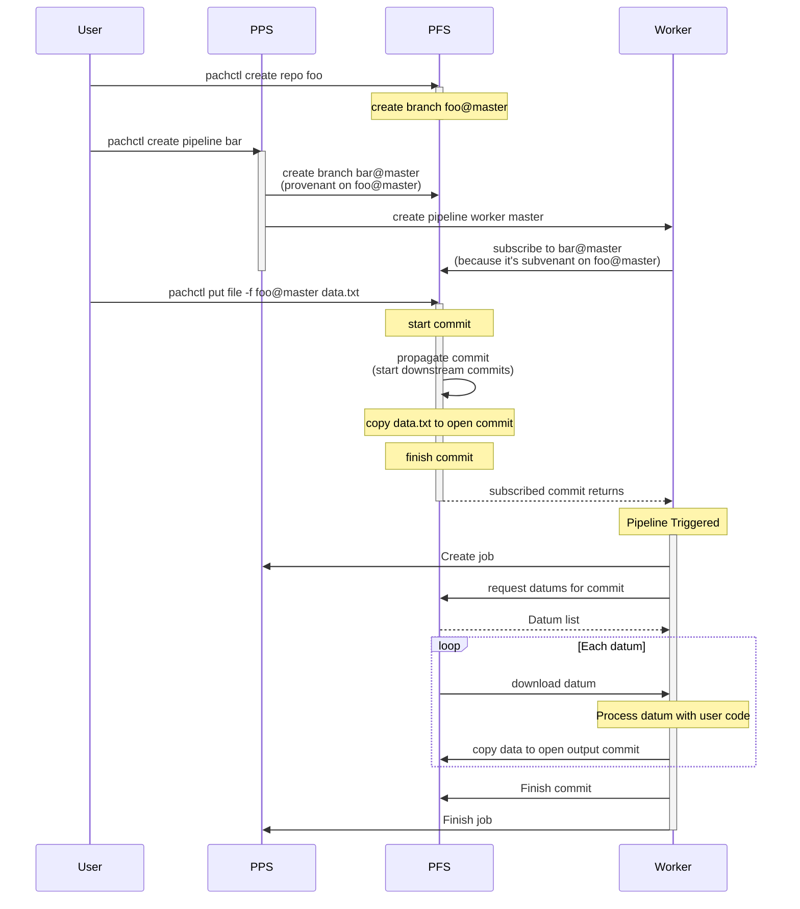

## Introduction to Pipelines
In the previous section, we explored how branches can be used to track changes to a set of files or collection of data over time. But once you have data, you'll typically want to do something with it, whether it's transforming it, running tests on it, or even training a machine learning model. This is where the **Pachyderm Pipeline System (PPS)** comes in.

PPS is the component of Pachyderm that applies code to your data. Pipelines work directly with data stored in your repositories, which means that you can deploy a pipeline to transform the data from your data repository, and anytime you modify the data, the pipeline will automatically re-run.

In Pachyderm, a pipeline refers to a single step in your computational graph. It's defined by a pipeline specification and runs in Kubernetes. While this may initially seem like a challenging concept, let's look at a sample pipeline then work through an example to better understand how pipelines work in Pachyderm.

## Pipeline Specification 
This is a Pachyderm pipeline definition in YAML format that describes a pipeline called transform that takes data from the data repository and transforms it using a Python script `my_transform_code.py`.

```yaml
pipeline: 
  name: transform
input: 
  pfs: 
    repo: data
    glob: "/*"
transform:
  image: python:3.9
cmd:
  - python
  - "/my_transform_code.py"
  - "--input"
  - "/pfs/data/"
  - "--output"
  - "/pfs/out/"
  ```

Here's a breakdown of the different sections of the pipeline definition:

- **pipeline** section specifies the name of the pipeline (in this case, it's transform).
- **input** section specifies the input for the pipeline. In this case, the input is taken from the data repository in Pachyderm. glob is used to specify which files to select from the repository. In this case, `/*` is used to select all files in the repository.
- **transform** section specifies the Docker image that will be used to execute the transformation. In this case, it's a `Python 3.9` image.
- **cmd** section specifies the command that will be run inside the container. In this case, the command is to run the `my_transform_code.py` Python script with the `--input` and `--output` flags, specifying the input and output directories respectively. `/pfs/data/` and `/pfs/out/` are directories created by Pachyderm that represent the input and output repositories respectively.

So, in summary, this pipeline definition defines a pipeline called transform that takes all files in the data repository, runs a Python script to transform them, and outputs the results to the out repository.


## Datums and Jobs
Pachyderm pipelines allow you to parallelize computation across a cluster. To distribute data, we can use datums. In Pachyderm, datums are used as a way to distribute processing workloads by splitting data into indivisible pieces.

For example, say you have a bunch of images that you want to normalize to a single size. You could iterate through each image and use opencv to change the size of it. No image depends on any other image, so this task can be parallelized by treating each image as an individual unit of work, a datum. 

Next, let’s say you want to create a collage from those images. Now, we need to consider all of the images together to combine them. In this case, the collection of images would be a single datum, since they are all required for the process. 

Pachyderm input specifications can handle both of these situations with the glob section of the Pipeline Specification. 

### Basic Glob Patterns
In the pipeline specification below, the input glob pattern is `/*`. It will treat each image of the images@master data repository (at the top level) as an individual unit of work. 

```yaml
pipeline:
  name: resize
description: A pipeline that resizes an image.
input:
  pfs:
    glob: /*
    repo: images
transform:
  cmd:
    - python
    - resize.py
    - --input
    - /pfs/images/*
    - --output
    - /pfs/out/
  image: pachyderm/opencv
```

When the pipeline runs, first the datums are computed from the input spec. The files from this datum will be downloaded into the Docker container when it starts. Then the transform will be executed. 


In this example, the input glob pattern is `/`. It will treat everything at the top level of the images@master data repository (at the top level) as an individual unit of work. 

```yaml
pipeline:
  name: collage
description: A pipeline that creates a collage for a collection of images.
input:
  pfs:
    glob: /
    repo: images
transform:
  cmd:
    - python
    - collage.py
    - --input
    - /pfs/images/*
    - --output
    - /pfs/out/
  image: pachyderm/opencv
```


### Advanced Glob Patterns
Datums can also be created from advanced operations, such as Join, Cross, Group, Union, and others to combine glob patterns from multiple data repositories. This allows us to create complex datum definitions, enabling sophisticated data processing pipelines. 


## Pipeline Communication (Advanced)
A much more detailed look at how Pachyderm actually triggers pipelines is shown in the sequence diagram below. This is a much more advanced level of detail, but knowing how the different pieces of the platform interact can be useful.

