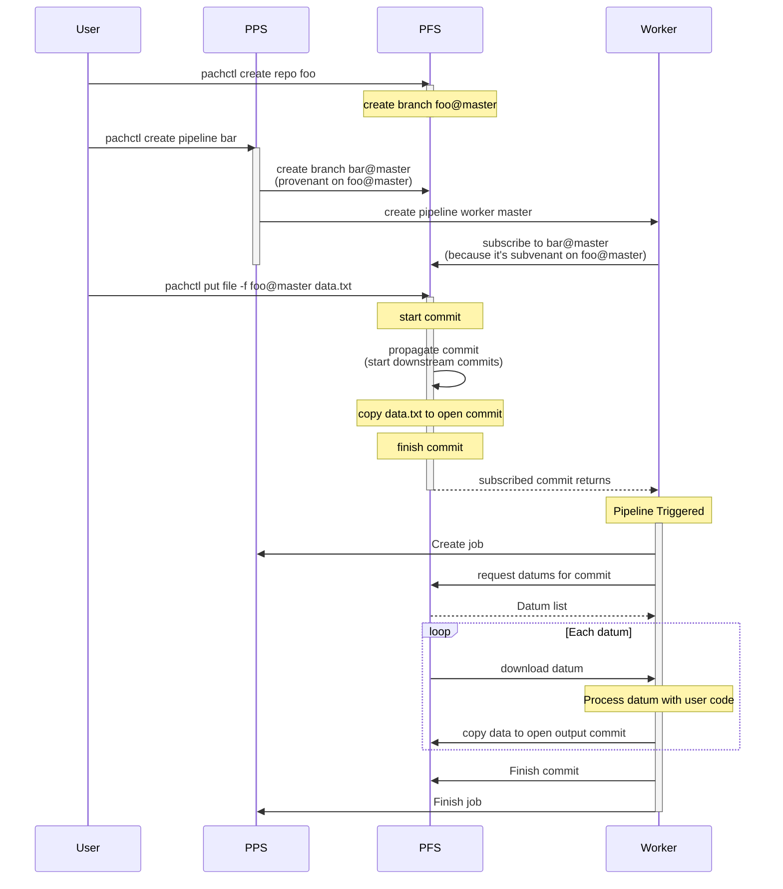

## Introduction to Pipelines
The **Pachyderm Pipeline System (PPS)** is how code gets applied to your data. Pipelines work seamlessly with data inside your data repositories, meaning that we can deploy a pipeline to transform the data from a data repo or repos, and anytime we modify our data, the pipeline will automatically re-run.

In Pachyderm, a pipeline is defined by a pipeline specification and runs in Kubernetes. Note: Unlike other frameworks, a pipeline refers to a single step in your computational DAG (directed acyclic graph), as many operations can be performed in a single pipeline execution. 

## Pipeline Specification 
This is a Pachyderm pipeline definition in YAML. It describes a pipeline called transform that takes data from the data repository and transforms it using a Python script `my_transform_code.py`.

```yaml
pipeline: 
  name: transform
input: 
  pfs: 
    repo: data
    glob: "/*"
transform:
  image: my-transform-image:v1.0
  cmd:
    - python
    - "/my_transform_code.py"
    - "--input"
    - "/pfs/data/"
    - "--output"
    - "/pfs/out/"
```

Here's a breakdown of the different sections of the pipeline definition:

- **pipeline** specifies the name of the pipeline (in this case, it's transform). This name will also be used as the name for the output data repository. 
- **input** specifies the input for the pipeline. In this case, the input is taken from the `data` repository in Pachyderm. `glob` is used to specify how the files from the repository map to datums for processing. In this case, `/*` is used to specify all files in the repository can be processed individually.
- **transform** specifies the code and image to use for processing the input data. The `image` field specifies the Docker image to use for the pipeline. In this example, the image is named `my-transform-image` with a tag of `v1.0`. The `cmd` field specifies the command to run inside the container. In this example, the command is `python /my_transform_code.py`, which runs a Python script named `my_transform_code.py`. The script is passed the `--input` flag pointing to the input data directory, and the `--output` flag pointing to the output data directory. `/pfs/data/` and `/pfs/out/` are directories created by Pachyderm. The input directory will contain an individual datum when the job is running, and anything put into the output directory will be committed to the output repositories when the job is complete.

So, in summary, this pipeline definition defines a pipeline called transform that takes all files in the data repository, runs a Python script to transform them, and outputs the results to the out repository.


## Datums and Jobs

Pipelines can distributed work across a cluster to parallelize computation. Each time data is committed to a Pachyderm repository, a job is created for each pipeline with that repo as an input to process the data.

To determine how to distribute data and computational work, datums are used. A **datum** is an indivisible unit of data required by the pipeline, defined according to the pipeline spec. The datums will be distributed across the cluster to be processed by workers. 


{}
Only one job per pipeline will be created per commit, but there may be many datums per job.
{}


For example, say you have a bunch of images that you want to normalize to a single size. You could iterate through each image and use opencv to change the size of it. No image depends on any other image, so this task can be parallelized by treating each image as an individual unit of work, a datum. 

Next, let’s say you want to create a collage from those images. Now, we need to consider all of the images together to combine them. In this case, the collection of images would be a single datum, since they are all required for the process. 

Pachyderm input specifications can handle both of these situations with the glob section of the Pipeline Specification. 

### Basic Glob Patterns
In the pipeline specification below, the input glob pattern is `/*`. It will treat each image of the images@master data repository (at the top level) as an individual unit of work. 

```yaml
pipeline:
  name: resize
description: A pipeline that resizes an image.
input:
  pfs:
    glob: /*
    repo: images
transform:
  cmd:
    - python
    - resize.py
    - --input
    - /pfs/images/*
    - --output
    - /pfs/out/
  image: pachyderm/opencv
```

When the pipeline runs, first the datums are computed from the input spec. The files from this datum will be downloaded into the Docker container when it starts. Then the transform will be executed. 


In this example, the input glob pattern is `/`. It will treat everything at the top level of the images@master data repository (at the top level) as an individual unit of work. 

```yaml
pipeline:
  name: collage
description: A pipeline that creates a collage for a collection of images.
input:
  pfs:
    glob: /
    repo: images
transform:
  cmd:
    - python
    - collage.py
    - --input
    - /pfs/images/*
    - --output
    - /pfs/out/
  image: pachyderm/opencv
```


### Advanced Glob Patterns
Datums can also be created from advanced operations, such as Join, Cross, Group, Union, and others to combine glob patterns from multiple data repositories. This allows us to create complex datum definitions, enabling sophisticated data processing pipelines. 


## Pipeline Communication (Advanced)
A much more detailed look at how Pachyderm actually triggers pipelines is shown in the sequence diagram below. This is a much more advanced level of detail, but knowing how the different pieces of the platform interact can be useful.

Before we look at the diagram, it may be helpful to provide a brief recap of the main participants involved:

- **User:** The user is the person interacting with Pachyderm, typically through the command line interface (CLI) or one of the client libraries.
- **PFS (Pachyderm File System):** PFS is the underlying file system that stores all of the data in Pachyderm. It provides version control and lineage tracking for all data inside it.
- **PPS (Pachyderm Pipeline System):** PPS is how code gets applied to the data in Pachyderm. It manages the computational graph, which describes the dependencies between different steps of the data processing pipeline.
- **Worker:** Workers are Kubernetes pods that executes the jobs defined by PPS. Each worker runs a container image that contains the code for a specific pipeline. The worker will iterate through the datums it is given and apply user code to it.




This diagram illustrates the data flow and interaction between the user, the Pachyderm Pipeline System (PPS), the Pachyderm File System (PFS), and a worker node when creating and running a Pachyderm pipeline. Note, this is simplified for the single worker case. The multi-worker and autoscaling mechanisms are more complex. 

The sequence of events begins with the user creating a PFS repo called `foo` and a PPS pipeline called `bar` with the foo repo as its input. When the pipeline is created, PPS creates a branch called `bar@master`, which is provenant on the `foo@master` branch in PFS. A worker pod is then created in the Kubernetes cluster by PPS, which subscribes to the `bar@master` branch.

When the user puts a file named `data.txt` into the `foo@master` branch, PFS starts a new commit and propagates the commit, opening downstream commits for anything impacted. The worker receives the subscribed commit and when it finishes, triggers the pipeline.

The triggered pipeline creates a job for the pipeline, requesting datums for the output commit. For each datum, the worker downloads the data, processes it with the user's code, and writes the output to an open output commit in PFS. Once all datums have been processed, the worker finishes the output commit and the job is marked as complete.