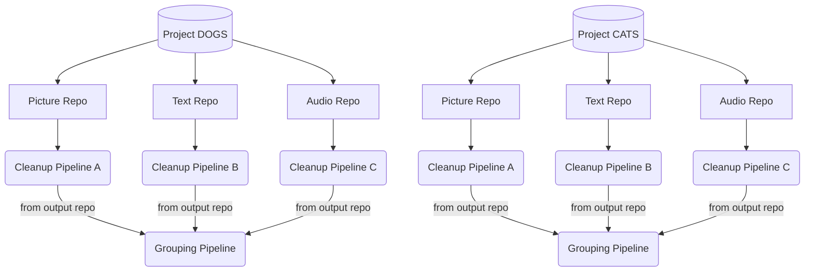

---
# metadata #
title:  Project Operations
description: Learn how to create, delete, and update projects
date:
# taxonomy #
tags: ["projects"]
series:
seriesPart:

weight: 
mermaid: true
---

Projects are logical collections of related work (such as repos and pipelines). Each MLDM cluster ships with an initial project named `default`. PachCTL supports all Project operations, such as adding/removing team members, resources, etc. MLDM Console can be used to view and access Projects. Pachyderm's integrations with JupyterLab, Seldon, S3 Gateway, and DeterminedAI also support
projects. 

## Benefits of Projects

- **Logical Organization of DAGs**: Similar to a file system, you can organize your work  within a MLDM instance.

- **Standardizable**: Resources like repos can have the same name if they belong to different projects, making it easier to create and adhere to project templates in a collaborative environment. For example, `ProjectA.Repo1` and `ProjectB.Repo1`.

- **Multi-team Enablement**: With Enterprise Pachyderm, You can grant access to projects based on roles; projects are hidden from users without access by default. 

## Example

In the following example there are two projects: `DOGS` and `CATS`. They have similarly named repositories and pipelines. With Enterprise Pachyderm, you could scope access to each project by user or user group.

## Limitations 

- You currently cannot move existing repos or pipelines between different projects. 

---
