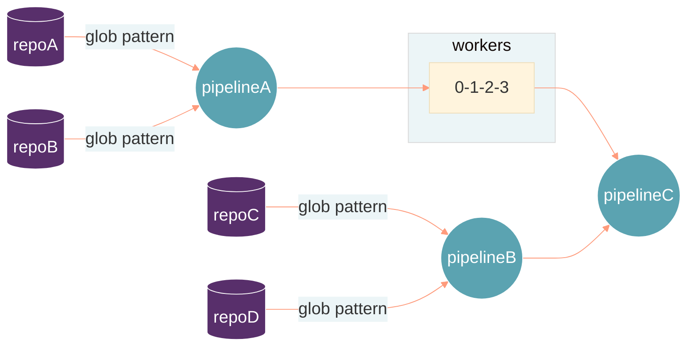

```mermaid
%%{init: {'theme': 'base', 'themeVariables': { 'lineColor': '#fe9b7c', 'fontSize':'20px', 'tertiaryColor':'#ecf5f7', 'secondaryColor':'#ecf5f7'}}}%%
graph LR
    A[(repoA)] -- glob pattern --> C
    B[(repoB)] -- glob pattern -->  C((pipelineA))
    C --> 0-1-2-3
    D[(repoC)] -- glob pattern --> F
    E[(repoD)] -- glob pattern -->  F((pipelineB))
    subgraph workers
        direction LR
        0-1-2-3
    end
    0-1-2-3 --> G((pipelineC))
    F --> G((pipelineC))
    style A fill:#582f6b,color:#fff,stroke:#fff
    style B fill:#582f6b,color:#fff,stroke:#fff
    style C fill:#5ba3b1,color:#fff,stroke:#fff
    style D fill:#582f6b,color:#fff,stroke:#fff
    style E fill:#582f6b,color:#fff,stroke:#fff
    style F fill:#5ba3b1,color:#fff,stroke:#fff
    style G fill:#5ba3b1,color:#fff,stroke:#fff
```