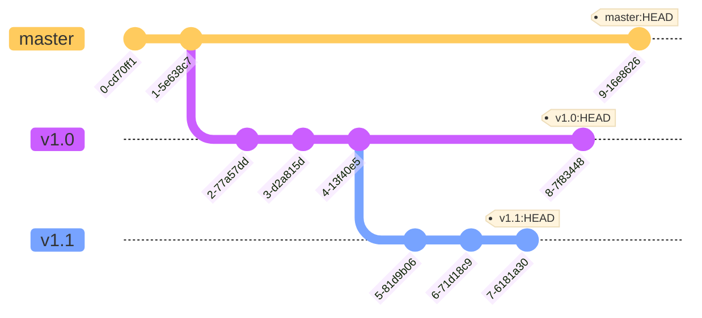

## Introduction to Data Versioning
On this page we want to give a brief overview of how to use and interact with versioned data inside Pachyderm. Collectively, this is often referred to as the **Pachyderm File System (PFS)**.

## Repositories

Data versioning in Pachyderm starts with creating a data repository. Pachyderm data repos are similar to Git repositories in that they provide a place to track changes made to a set of files. 

Using the Pachyderm CLI (`pachctl`) we would create a repository called data with the create repo command. 

```bash
pachctl create repo data
```

Once a repo is created, data can be added, deleted, or updated to a branch and all changes are versioned with commits. 


## Commits
In Pachyderm, commits are made to branches of a repo. For example, in the following session if we add a file to our data repository, that file will be captured in a commit. 

```bash
$ pachctl put file data@master -f my_file.bin

$ pachctl list commit images@master
REPO   BRANCH  COMMIT   FINISHED       SIZE      ORIGIN 
data   master  6806cce  4 seconds ago  57.27KiB  USER

$ pachctl list file data@master
NAME         TYPE SIZE
/my_file.bin file 57.27KiB
```

If we then delete that file, it is removed from the active state of the branch, but the commit still exists. 

```bash
$ pachctl delete file data@master:/my_file.bin

$ pachctl list commit data@master
REPO  BRANCH  COMMIT   FINISHED        SIZE      ORIGIN 
data  master  ff1867a  3 seconds ago   0B        USER
data  master  6806cce  20 seconds ago  57.27KiB  USER

$ pachctl list file data@master
NAME TYPE SIZE
```

Then if we add the file back, we'll see a third commit. 

```bash
$ pachctl create file data@master:/my_file.bin

$ pachctl list commit data@master
REPO  BRANCH  COMMIT   FINISHED        SIZE      ORIGIN 
data  master  0ec029b  20 seconds ago  57.27KiB  USER
data  master  ff1867a  3 seconds ago   0B        USER
data  master  6806cce  20 seconds ago  57.27KiB  USER

$ pachctl list file data@master
NAME         TYPE SIZE
/my_file.bin file 57.27KiB
```

Visualizing the commit history for the master branch looks like the following. 


Branches are a critical for tracking commits. The branch functions as a pointer to the most recent commit to the branch. For instance, when we create a new commit on the master branch (`pachctl put file data@master -f my_new_file`), we would create a new commit and our master branch would point at it.


As we've already seen, we can reference the HEAD of the branch, with the syntax, `data@master`. 


### Navigating Commits


Here we'll introduce the basics of how to navigate commits. Navigating these commits is an important aspect of working with PFS, and allows you to easily manage the history and evolution of your data.

One useful feature for navigating commits in PFS is the ability to refer to a previous commit using ancestry syntax. This syntax allows you to specify a commit relative to the current one, making it easy to compare and manipulate different versions of your data. 

This makes it simple to switch between different versions of your data, and to perform operations like diffing, branching, and merging. 


To refer to the commit 2 before the HEAD: 


Similarly, we can abbreviate this with the following syntax: 


We can reference the commits in numerical order using `.n`, where `n` is the commit number.


## Branches

In Pachyderm, branches are used to track changes in a repository. You can think of a branch as a tag on a specific commit. Branches are associated with a particular commit and are updated as new commits are made (moving the `HEAD` of that branch to its most recent commit). This also means that at any time, you can change the commit that a branch is associated with, affecting branch history.

Here's an example of a repo with three branches, each with its own history of commits:




### "Merging" Branches
The concept of merging binary data from different commits is complex. Ultimately, there are too many edge cases to do it reliably for every type of binary data, because computing a diff between two commits is ultimately meaningless unless you know how to compare the data. For example, we know that text files can be compared line-by-line or a bitmap image pixel by pixel, but how would we compute a diff for, say, binary model files? 

Additionally, the output of a merge is usually a master copy, the official set of files desired. We rarely combine multiple pieces of image data to make one image, and if we are, we have usually created a technique for doing so. In the end, some files will be deleted, some updated, and some added. 

Instead, merging data, means creating a new commit with the desired combination of files and pointing our branch at that commit. In order to maintain a proper history, we would also want to make sure that the parent of that commit is relevant to what we want as well. 

For example, in this situation, we have created a branch, `dev`, based on the 1-2833cd3 commit. We have committed multiple times to the dev branch, but nothing to master. 


In this case it is simple to simply move the master branch to follow the most recent commit on dev, `4-41a750b`. 

`pachctl create branch data@master --head 41a750b`

Which would look like this: 


Or from the history perspective of the respective branches:  


Branches are useful for many reasons, but in Pachyderm they also form the foundation of the pipeline system. New commits on branches can be used to trigger pipelines to run, resulting in one of the key differentiators, data-driven pipelines.