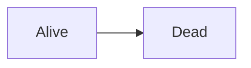

---
# metadata # 
title:  Black Screen of Death
description: Displays a black screen signifying death of the machine; may or may not contain ghosts. 
date: 
label: arbitrary label
mermaid: true 
tags: ["2.3.x", "2.2.x"]
versions:
    2.3x: ["2.3.1", "2.3.2"]
    2.4.x: ["2.2.2"]
---

## Issue 

Blah blah blah.

|this|is|a|table|:)|
|-|-|-|-|-|
|one|two|three|four|five|
|one|two|three|four|five|
|one|two|three|four|five|
|one|two|three|four|five|

## Impact 

Completely fatal, sorry.

